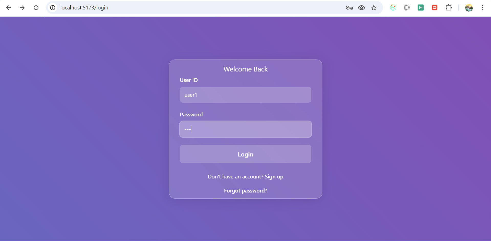
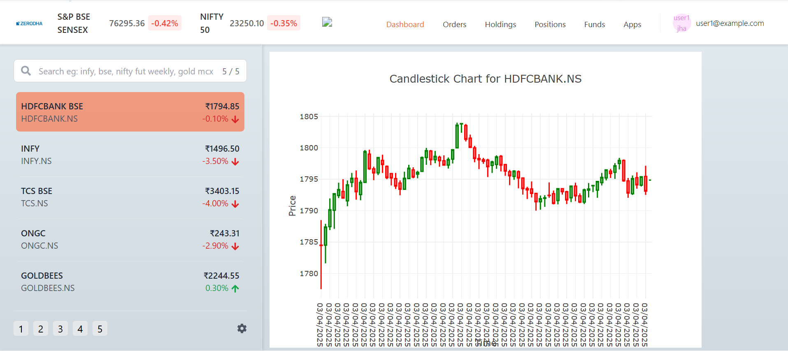

# 📈 Stock Movement Prediction

This is a comprehensive stock movement prediction web application that fetches live stock data from the Zerodha website and displays predictions on charts using machine learning models.

## ✨ Features
- **🔒 User Authentication:** Custom authentication system using user ID and password.
- **📊 Dashboard:** Displays live stock data with an interactive chart and a watchlist of selected stocks.
- **🤖 Prediction Model:** Predicts stock prices for five companies and displays them on the chart.

## 🛠️ Tech Stack
- **Frontend:** React, Tailwind CSS
- **Backend:** Node.js, Express.js
- **Machine Learning Model:** Python (To be integrated)
- **Live Data Fetching:** Zerodha website

## 🚀 Installation

1. Clone the repository:
```bash
  git clone https://github.com/yourusername/stock-movement-prediction.git
```

2. Navigate to the project directory:
```bash
  cd stock-movement-prediction
```

3. Install dependencies:
```bash
  npm install
```

4. Run the application:
```bash
  npm run dev
```

## 🔑 Authentication System
The application uses a custom authentication system with user ID and password.
- **Sign Up:** Users can create an account by providing their first name, last name, email, user ID, and password.
- **Login:** Users can log in using their user ID and password.
- **Session Management:** User session is maintained using tokens stored in context with expiration handling.

## 📸 Screenshots

### 🔐 Login Page


### 📊 Dashboard


## 📖 Usage
1. Sign up and log in using your user ID and password.
2. View the dashboard displaying live stock data and your selected watchlist.
3. Select stocks to view predictions on the chart.

## 📄 License
MIT

